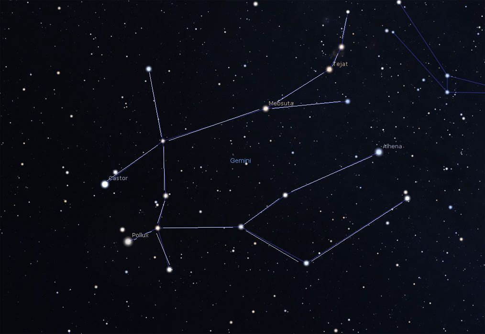

# Gemini

Gemini is prominent in the winter skies of the northern Hemisphere and is visible the entire night in December–January.

If you find Castor and Pollux, you find me.

## INTRODUCTION

1. Gemini is a superscalar MIPS cpu which has eight-stage pipeline and dual issue logic.

2. We add branch predictor, i-cache, d-cache, TLB, MMU into our design. Finally, we built it on FPGA at 100Mhz.

3. Gemini can run a simple Linux [uCore](https://github.com/chyh1990/ucore-thumips).
4. We test the cache hit rate. I-cache hit rate is about 99%. D-cache hit rate is about 98%.
5. IPC is about 30.331.

## REFERENCE

[1] 戴维A.帕特森(David A.Patterson),约翰L.亨尼斯(John L.Hennessy). 计算机组成与设计: 硬件/软件接口[M].北京:机械工业出版社, 2015-7-1.

[2] 姚永斌. 超标量处理器设计[M].北京:清华大学出版社, 2014.

[3] 汪文祥, 邢金璋.CPU设计实战[M]. 北京:机械工业出版社, 2021.